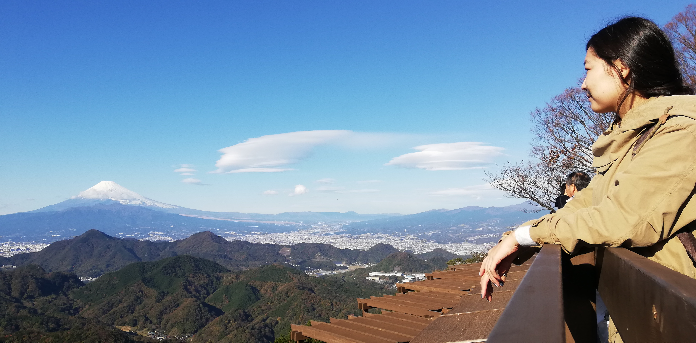

:wave:

Hi there, thanks for visiting my blog :smile:

I am Azjargal Gankhuyag, please call me `Aza`. From Mongolia [:mongolia:], currently living in Tokyo, Japan :japan:.

I am software engineer mainly doing Front-End development recently.

## Quick RESUME

- **Education**
  
  Bachelors of Computer Science (Ulaanbaatar, Mongolia in 2011-2015)

  Masters of Computer Science (M.Tech from Indian Institute of Technology Bombay [IITB]), (Mumbai, India in 2016-2018)

- **Work experience**
  
    IT specialist @ KHANBANK

  Software engineer @ Konica Minolta Inc.,

## Hobbies/Interests

**Interests:** I love to try new things and explore new places and **HIKING** :mountain: :walking:

**Things I do daily**

- Yoga
- Read few chapters of books
- Writing (anything in fact)
- Video call to my mom
- Coding/Development work
- Surf github
- Try to find something NEW (books, repo, blogs, websites, anything!)
- Listen jazz, lo-fi, vintage music

> I like to do something meaningful in my life, indeed so do you.

